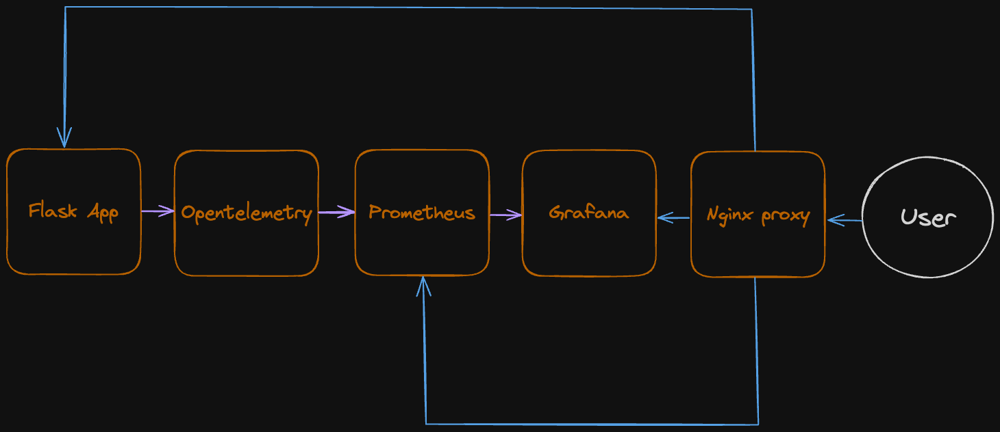

<a name="readme-top"></a>

[![Contributors][contributors-shield]][contributors-url]
[![Forks][forks-shield]][forks-url]
[![Stargazers][stars-shield]][stars-url]
[![Issues][issues-shield]][issues-url]
[![MIT License][license-shield]][license-url]
[![LinkedIn][linkedin-shield]][linkedin-url]

<h3 align="center">Opentelemetry monitoring</h3>

  <p align="center">
    ·
    <a href="https://github.com/vloneskorpion/opentelemetry-project/issues/new?labels=bug&template=bug-report---.md">Report Bug</a>
    ·
    <a href="https://github.com/vloneskorpion/opentelemetry-project/issues/new?labels=enhancement&template=feature-request---.md">Request Feature</a>
  </p>
</div>

<!-- TABLE OF CONTENTS -->
<details>
  <summary>Table of Contents</summary>
  <ol>
    <li>
      <a href="#about-the-project">About The Project</a>
    </li>
    <li>
      <a href="#getting-started">Getting Started</a>
      <ul>
        <li><a href="#prerequisites">Prerequisites</a></li>
        <li><a href="#how-to-run">How to run</a></li>
      </ul>
    </li>
    <li><a href="#usage">Usage</a></li>
    <li><a href="#roadmap">Roadmap</a></li>
    <li><a href="#contributing">Contributing</a></li>
    <li><a href="#license">License</a></li>
    <li><a href="#contact">Contact</a></li>
  </ol>
</details>

<!-- ABOUT THE PROJECT -->
## About The Project

The main goal of this project was to create an easy-to-use stack for monitoring simple Flask app using Opentelemetry, Prometheus, Grafana, Nginx and Docker.
<br>Following image shows relation between each component:



Flask app sends metrics to Opentelemetry which are fetched by Prometheus and then displayed in Grafana. Nginx acts as a entry point for user to access the webpage, Prometheus or Grafana dashboard.

<p align="right">(<a href="#readme-top">back to top</a>)</p>

<!-- GETTING STARTED -->
## Getting Started

### Prerequisites

Docker is needed in order to use this project.
See Docker [documentation](https://docs.docker.com/engine/install/) for installation instructions.

### How to run

1. Clone the repo
    ```bash
    git clone https://github.com/vloneskorpion/opentelemetry-project.git
    ```
2. Change directory
    ```bash
    cd opentelemetry-project
    ```
3. Start containers using docker compose
    ```bash
    docker compose up --build
    ```

<p align="right">(<a href="#readme-top">back to top</a>)</p>

<!-- USAGE EXAMPLES -->
## Usage

After starting containers you can access Grafana on http://localhost/grafana and Prometheus on http://localhost/prometheus. You can also access Flask app on http://localhost/app.

In order to see metrics in Grafana go to dashboards -> Python-App dashboard. Graphs should be visible. To generate some request data you need to access flask app http://localhost/app - it can be done via curl or your favorite browser.

Stable requests load can be generated using following command:
  ```bash
      while true; do curl http://localhost/app; sleep 0.5; done
  ``` 

<p align="right">(<a href="#readme-top">back to top</a>)</p>

<!-- ROADMAP -->
## Roadmap

TODOs will be added here.

See the [open issues](https://github.com/vloneskorpion/opentelemetry-project/issues) for a full list of proposed features (and known issues).

<p align="right">(<a href="#readme-top">back to top</a>)</p>

<!-- CONTRIBUTING -->
## Contributing

Contributions are what make the open source community such an amazing place to learn, inspire, and create. Any contributions you make are **greatly appreciated**.

If you have a suggestion that would make this better, please fork the repo and create a pull request. You can also simply open an issue with the tag "enhancement".
Don't forget to give the project a star! Thanks again!

1. Fork the Project
2. Create your Feature Branch (`git checkout -b feature/AmazingFeature`)
3. Commit your Changes (`git commit -m 'Add some AmazingFeature'`)
4. Push to the Branch (`git push origin feature/AmazingFeature`)
5. Open a Pull Request

<p align="right">(<a href="#readme-top">back to top</a>)</p>

<!-- LICENSE -->
## License

Feel free to use this project anywhere you want.

<p align="right">(<a href="#readme-top">back to top</a>)</p>

<!-- CONTACT -->
## Contact

Kamil Nowak - [Linkedin](https://linkedin.com/in/kamilnowak432) - kamilnowak432@gmail.com

<p align="right">(<a href="#readme-top">back to top</a>)</p>


<!-- MARKDOWN LINKS & IMAGES -->
<!-- https://www.markdownguide.org/basic-syntax/#reference-style-links -->
[contributors-shield]: https://img.shields.io/github/contributors/vloneskorpion/opentelemetry-project.svg?style=for-the-badge
[contributors-url]: https://github.com/vloneskorpion/opentelemetry-project/graphs/contributors
[forks-shield]: https://img.shields.io/github/forks/vloneskorpion/opentelemetry-project.svg?style=for-the-badge
[forks-url]: https://github.com/vloneskorpion/opentelemetry-project/network/members
[stars-shield]: https://img.shields.io/github/stars/vloneskorpion/opentelemetry-project.svg?style=for-the-badge
[stars-url]: https://github.com/vloneskorpion/opentelemetry-project/stargazers
[issues-shield]: https://img.shields.io/github/issues/vloneskorpion/opentelemetry-project.svg?style=for-the-badge
[issues-url]: https://github.com/vloneskorpion/opentelemetry-project/issues
[license-shield]: https://img.shields.io/github/license/vloneskorpion/opentelemetry-project.svg?style=for-the-badge
[license-url]: https://github.com/vloneskorpion/opentelemetry-project/blob/master/LICENSE.txt
[linkedin-shield]: https://img.shields.io/badge/-LinkedIn-black.svg?style=for-the-badge&logo=linkedin&colorB=555
[linkedin-url]: https://linkedin.com/in/kamilnowak432
[product-screenshot]: images/screenshot.png
[Next.js]: https://img.shields.io/badge/next.js-000000?style=for-the-badge&logo=nextdotjs&logoColor=white
[Next-url]: https://nextjs.org/
[React.js]: https://img.shields.io/badge/React-20232A?style=for-the-badge&logo=react&logoColor=61DAFB
[React-url]: https://reactjs.org/
[Vue.js]: https://img.shields.io/badge/Vue.js-35495E?style=for-the-badge&logo=vuedotjs&logoColor=4FC08D
[Vue-url]: https://vuejs.org/
[Angular.io]: https://img.shields.io/badge/Angular-DD0031?style=for-the-badge&logo=angular&logoColor=white
[Angular-url]: https://angular.io/
[Svelte.dev]: https://img.shields.io/badge/Svelte-4A4A55?style=for-the-badge&logo=svelte&logoColor=FF3E00
[Svelte-url]: https://svelte.dev/
[Laravel.com]: https://img.shields.io/badge/Laravel-FF2D20?style=for-the-badge&logo=laravel&logoColor=white
[Laravel-url]: https://laravel.com
[Bootstrap.com]: https://img.shields.io/badge/Bootstrap-563D7C?style=for-the-badge&logo=bootstrap&logoColor=white
[Bootstrap-url]: https://getbootstrap.com
[JQuery.com]: https://img.shields.io/badge/jQuery-0769AD?style=for-the-badge&logo=jquery&logoColor=white
[JQuery-url]: https://jquery.com 